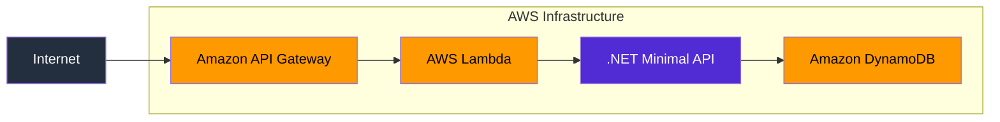

# AWS Clean Architecture Starter Kit

A .NET Clean Architecture solution template designed to provide a practical starting point for building serverless applications on AWS.

The goal of this project is to reduce the amount of boilerplate and infrastructure work required to get a new API running on AWS while maintaining a clean and maintainable architecture.

## Current status
This project is actively maintained and under development.

The current version provides a deployable serverless foundation based on .NET, AWS Lambda, API Gateway, DynamoDB and AWS CDK.

Additional AWS services and deployment patterns will be added over time.

## Features
* Clean Architecture
* ASP.NET Core Minimal API
* AWS Lambda hosting
* AWS CDK Infrastructure as Code
* Amazon API Gateway integration
* Amazon DynamoDB persistence
* OpenAPI documentation
* FluentValidation
* Global exception handling
* Health check endpoints
* xUnit unit testing
* Architecture tests

## Architecture



The application is deployed as a serverless API using AWS Lambda and API Gateway. DynamoDB is used as the primary persistence store.

## Lambda

This starter kit uses ASP.NET Core Minimal APIs together with AWS Lambda Hosting.

The API project acts as the Lambda entry point and is deployed directly to AWS Lambda using AWS CDK.

Deployment assets are uploaded to the CDK bootstrap S3 bucket during deployment. These assets are managed by CDK bootstrap resources and are not part of the application stack.

## API Gateway

API Gateway is provisioned and configured using AWS CDK.

The gateway uses Lambda Proxy Integration, allowing all requests to be forwarded directly to the ASP.NET Core application where routing is handled by the Minimal API endpoints.

The current implementation includes:

* Automatic stage deployment
* API Key support
* Usage Plan configuration
* Lambda Proxy Integration

## DynamoDB

This starter kit uses the AWS SDK DynamoDBContext implementation for persistence.

A simple DynamoDB table with a single partition key is provisioned using AWS CDK.

The objective of V1 is to provide a straightforward serverless persistence model that works well with AWS Lambda and keeps the infrastructure easy to understand.

The following DynamoDB topics are intentionally out of scope for V1:

* Composite keys
* Sort keys
* Global Secondary Indexes (GSIs)
* Local Secondary Indexes (LSIs)
* Single-table design patterns
* Advanced DynamoDB modelling

These may be explored in future versions of the starter kit.

## Infrastructure as Code

Infrastructure is defined using AWS CDK and follows a multi-stack approach to separate concerns and improve maintainability.

Current infrastructure components include:

* AWS Lambda
* Amazon API Gateway
* Amazon DynamoDB
* IAM permissions and integrations

The intention is that the entire solution can be deployed without requiring manual configuration in the AWS Console.

## Project Status

### Implemented

* Clean Architecture solution structure
* .NET Template Engine integration
* AWS Lambda deployment
* API Gateway integration
* DynamoDB integration
* OpenAPI documentation
* FluentValidation
* Global exception handling
* Health checks
* Unit tests
* Architecture tests

### Planned

* CI/CD pipelines
* Authentication and authorisation
* Advanced DynamoDB modelling
* Event-driven architecture examples
* Additional AWS service integrations

## Disclaimer

This project is intended to be a practical starting point rather than a complete production-ready framework.

The focus is on providing a maintainable foundation that developers can understand, extend, and adapt to their own requirements.

## Solution Template Usage
### Install the Template Locally

Clone the repository:

```bash
git clone <repo-url>
cd <repo-folder>
```

Install the template locally by running the PowerShell script `install-template.ps1` 
or shell script `install-template.sh` provided in the repository.

Otherwise, you can install the template directly using the .NET CLI by running:

```bash
dotnet new install ./
```
After installation, the template should be available through the .NET CLI and supported IDEs such as JetBrains Rider.

You can verify the template is installed by running:

```bash
dotnet new list
```

### Create a New Solution

Create a new solution from the template:
```bash
dotnet new <template-short-name> -n MyProject
```

Navigate into the generated solution and build the solution:
```bash
cd MyProject
dotnet build
```

At this stage, the generated project should compile successfully before any AWS deployment steps are attempted.

### Important

Replace `<template-short-name>` with the exact shortName from your .template.config/template.json. 
That short name is what users type after `dotnet new`.

## Deploying to AWS
### Prerequisites

The following tools must be installed before creating and deploying a solution from this template.

#### .NET SDK

Install the latest supported .NET SDK.

Verify the installation:

```bash
dotnet --version
```

#### Docker Desktop

Docker is required for AWS Lambda asset bundling during CDK deployments.

Verify the installation:

```bash
docker --version
```

#### Node.js

AWS CDK CLI requires Node.js.

This starter kit has been tested using Node.js 22.

Verify the installation:

```bash
node --version
```

#### AWS CLI

Install the AWS CLI.

Verify the installation:

```bash
aws --version
```

#### AWS CDK CLI

Install the AWS CDK CLI globally:

```bash
npm install -g aws-cdk
```

Verify the installation:

```bash
cdk --version
```

#### AWS Credentials

Configure AWS credentials and default region:

```bash
aws configure
```

Verify the configuration:

```bash
aws sts get-caller-identity
```

### Deploy Infrastructure

Navigate to the Infrastructure as Code project:

```bash
cd src/Framework/Ghanavats.CleanArchitecture.IaC.AWS
```

#### CDK Bootstrap

Before deploying the infrastructure for the first time, bootstrap the AWS account:

```bash
cdk bootstrap
```

CDK bootstrap creates AWS resources required by CDK deployments, including an S3 bucket used to store deployment assets.

This command only needs to be executed once per AWS account and region.

#### Deploy the Stacks

Deploy all infrastructure stacks:

```bash
cdk deploy --all
```

The deployment provisions the AWS resources required by the starter kit, including:

AWS Lambda
Amazon API Gateway
Amazon DynamoDB
IAM Roles and Permissions

Once deployment completes successfully, CDK will output useful deployment information such as API Gateway endpoints.

```bash
Destroy the Stacks
```

To remove all infrastructure provisioned by the starter kit:

```bash
cdk destroy --all
```

This command removes all resources created by the deployed stacks.

### API Key Authentication

The starter kit configures an API Key and Usage Plan in Amazon API Gateway.

API Key validation is performed by API Gateway before requests are forwarded to AWS Lambda.

The ASP.NET Core application does not validate API Keys and is unaware of the API Key configuration.

This mechanism provides a basic level of access control and request throttling but should not be considered a replacement for authentication and authorisation.

For production workloads, consider integrating a dedicated authentication provider such as Amazon Cognito or another identity provider.

**Feedback and suggestions are welcome.**
